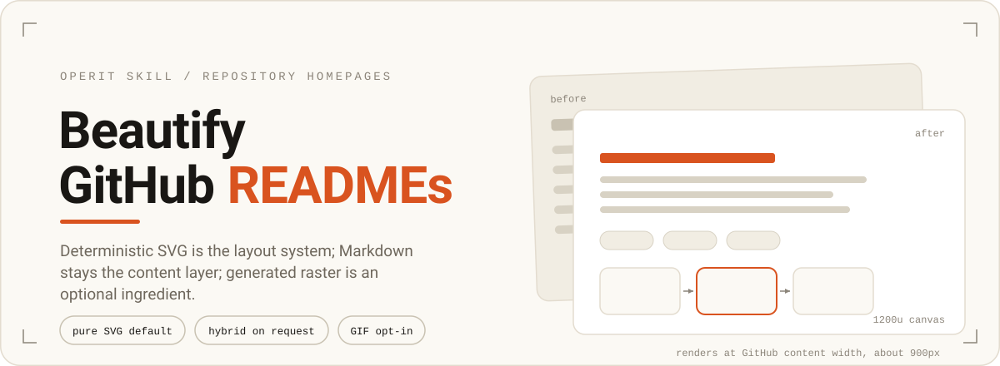
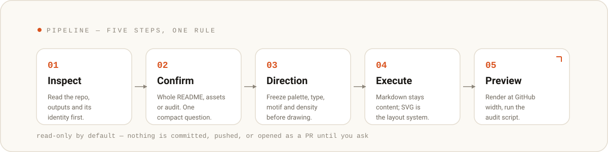

# beautify-github-readme

Turn a repository homepage into a concise, theme-specific visual story. Markdown is the content layer; deterministic SVG is the layout system; generated raster material is an optional ingredient.

## What it does

- **README mode** — restructure the whole README: reading order, copy hierarchy, proof, and a coordinated visual system.
- **Asset-only mode** — create just the requested visuals: hero, section headers, workflow diagrams, badges, or a coordinated set. Static SVG is the default; a GitHub-safe GIF is opt-in with the SVG kept as the editable fallback.
- **Audit mode** — inspect a README without changing it.

## How it works



One rule keeps it safe: the skill is **read-only by default**. It never commits, pushes, or opens a PR until you explicitly ask.

## How to use


```text
use beautify-github-readme to redesign this repository homepage
use beautify-github-readme to create one SVG hero and three section headers without modifying the README
```

## Install

Copy this directory to `Operit/skills/beautify-github-readme/` (must include `SKILL.md`).

---

Published from Operit by GitHub Publisher.
